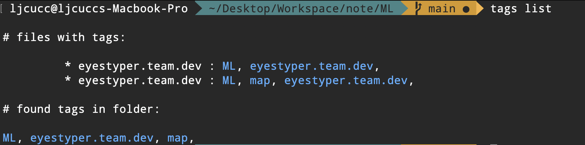
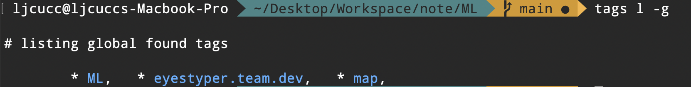
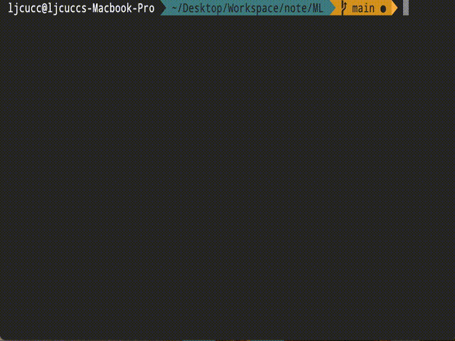

# TagSpaces CLI 🏷️
TagSpaces is great, but how about the terminal users? now there's the new tool to you! the Tagspaces CLI.
which compatible with the official sidecar format.

### What is **sidecar** ?

sidecar is one of method that TagSpaces using, which are a json files inside `.ts` folder to record tags you add for the files. find more info at [official documentation](https://docs.tagspaces.org/tagging#folder-tagging-with-sidecar-file)

## How to use?
### Installation
Adding tags script into your $PATH, then that it! currently support python, I'll build more version for that. or you are lazy to type command, here you go:
```bash
# bash
echo export "PATH=\$PATH":"$(pwd)/" >> ~/.bashrc

# zsh
echo export "PATH=\$PATH":"$(pwd)/" >> ~/.zshrc
```

### Listing



Listing tags of files and tags in folder by using:
```bash
tags list
# or (l) for abbr
tags l
```

Listing tags and remember it to global environment:
```bash
tags list --save
# or (-s) for abbr
tags l -s
```

Then using `--global` or `-g` to list all remembered tags in global environment:
```bash
tags list --global
# or (-g) for abbr
tags l -g
```
Demo:


### Adding



Adding new tag to file by using:

```bash
# (👇) will auto open an terminal UI to select file and tags
tags add

# (👇)  or ... (are the same)
tags new
tags n
```

With `--file [path2file]` tag you can add tag to file accurately without terminal UI:
```bash
# or using -f, --path or -p for --file instead
tags n -f ./README.md
tags n --path ./README.md
tags n -p ./README.md
```


## QnA

### Why only using **sidecar** ?
Because sidecar dose not effect the origin file name, while the file name become your relativity of everything, like README.md or some file links. sidecar by the other hand, that using json file to manage tags, which dose not effect the origin relativity. If you dont want to use sidecar method, then you may not need this tool for tagSpaces.

### Why using python3?
Becuase every morden computer have python3 preinstalled, so Python3 become the better options to build this tools. About the "Windows" side, I'm not consider to build it, becuase no much people are using termianl in windows (and terminal in windows is sucks, that's a common sens for sure :D )
